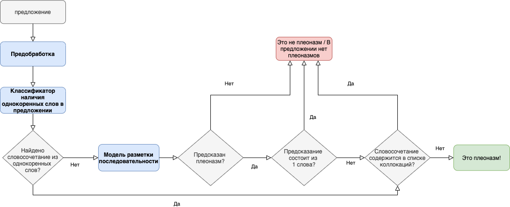

# Master thesis "Automatic Pleonasm Detection in Russian"
## Higher School of Economics, Computational Linguistics, 2020

The work introduces the first automated system of pleonasm detection in Russian

The pipeline is outlined as follows:

This repo provides code and data related to the developed architecture:

- data

  - preprocessing.py – preprocessing functions
  - classifier_data.py – data preparation for fasttext classifier 
  - sequence_labeling_data.py - data preparation for sequence labeling model
  
  - train.xlsx and test.xlsx – train and test data respectively. Files consist of the following columns:
    - text
    - tags (for sequence labeling)
    - class (for classifier)
  - predictions.xlsx – results of system application to unlabelled data, contains 3 lists, each corresponding to one of the corpora (opencorpora, gikrya, syntagrus)
  - data_ege.xlsx – results of system application to Unified State Exam data (56/100 pleonasms found)
  - collocations.txt – list of collocations used as filters at the last stage of our pipeline
  - udpipe
    - russian-syntagrus.udpipe – model of syntax analysis taken from [here](https://universaldependencies.org/treebanks/ru_taiga/index.html)
    
- models
  - classifier.py – classifier which decides whether a phrase consits of words of same root (fasttext + logistic regression)
  - sequence_labeling.py – sequence labeling model
  - trainer_seq_labeling.py
  
----
[Slides](https://docs.google.com/presentation/d/19T8sOG1MU6CF-w7pTXNjtTGzZ0nJmOpK8bsqYf6s5Qo/edit?usp=sharing)

----

**Contacts**:

e-mail: arrrina.r@gmail.com

telegram: @excuse_my_french
